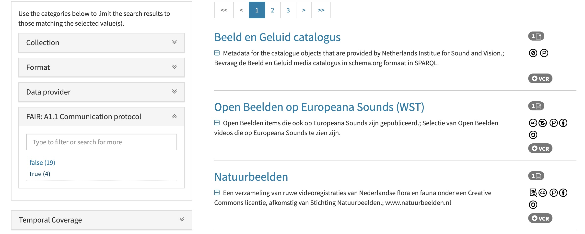
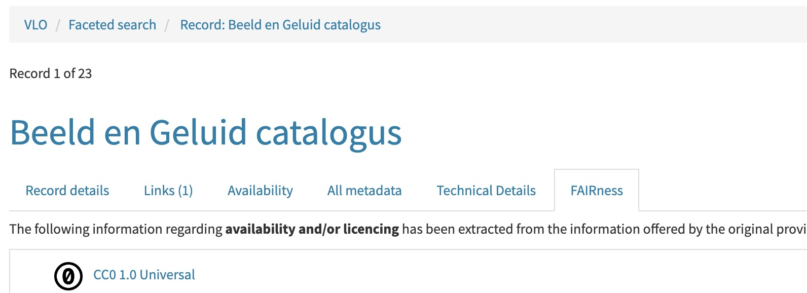

# Repositories involved

- [https://github.com/CLARIAH/VLO](https://github.com/CLARIAH/VLO)   
Bevat verschillende (maven) applicaties/componenten, o.a. de vlo-web-app
vlo-distribution contains software package, numbered from POM version.

- [https://gitlab.com/CLARIN-ERIC/docker-vlo-beta.git](https://github.com/CLARIAH/docker-vlo)   
Builds Docker image for the Virtual Language Observatory using a given WAR-file.
Currently it points a local file (REMOTE_RELEASE_URL), but should point to remote release.

- [https://github.com/CLARIAH/VLO-mapping](https://github.com/CLARIAH/VLO-mapping)   
Contains the facet definitions, amongst others. The definitions are, by default, on-the-fly retrieved from this location:   
`VLO-mapping/config/facetsConfiguration.xml`    
<i>Deze heb deze geforked onder wilkos-dans account, zodat ik de facet definitie zelf kan aanpassen.
Beter is deze file uit een lokale repo te halen (vanaf disk), echter werkte dat niet zo snel.</i>

- [https://github.com/CLARIAH/datasets-vlo.git](https://github.com/CLARIAH/datasets-vlo/tree/release-4.10)   
Docker Compose configuration for the Virtual Language Observatory (Deploys the Docker image, creates the container).   
Docker Compose configuration combines a Solr server and a VLO web app instance.

# Datasets records
The dataset records are harvested from CLARIAH and NDE Partners by the OAI-PMH Harvester Manager.   
The `dataroots.xml` file defines the local location of the records and other stuff, like Dataprovider Name (originName).


# Howto add new facet to VLO

This howto serves as a poc for adding a new facet to the VLO. The final goal is to display the added facets on a 
separate tab in VLO portal. 

Most of the current work is done in `vlo-commons` and `vlo-importer` module.  

## Files modified in order to add new facet to VLO: 
Files to be modified in `vlo-commons` module:
- **/src/main/java/eu/clarin/cmdi/vlo/FieldKey.java**: Field is only added to VLO when it's defined here. It is **not** yet a facet, but an java Enum. I.e: `FAIR_A_1_1`
- **/resources/VloConfig.xml**: Contains, amongst other, the Solr fieldname mappings to a java Enum. Make sure both exist. I.e: `<field key="FAIR_A_1_1">cLp_fair_a1_1</field>`
- **/resources/VloConfig.xsd**: Adds the java Enum as a type: i.e: `<xs:enumeration value="FAIR_A_1_1" />`. 

Files to be modified in `vlo-importer` module, path: `vlo-importer/src/main/java/eu/clarin/cmdi/vlo/importer/`.
- **./Metadataimporter.java**: Maps a post-processor to a field(key). This is also the entrypoint for checking fairness of the field. (line 262) `FieldKey.FAIR_A_1_1, () -> new CommunicationProtocolPostNormalizer()`
- **./processor/FacetProcessorVTDXML.java**: Line 83, #processFacets() method. Not sure if this is the best place for calling code for combining value given by processors/post-processors.
- **./normalizer/CommunicationProtocolPostNormalizer.java**: Defines the actual facet logic: In this case a simple function for assessing fairness of the field.
The importer module will load the Solr config and datasets into the Docker (see below).

Files to be modified in `vlo-web-app` module, path: `vlo-web`
- **/src/main/resources/fieldNames.properties**: This file sets the (facet) wicket-label on the web page for each field. 

Solr needs to know the field configuration before it can treat the new field as a facet. Therefore you need to add the Solr fieldname (in this example `cLp_fair_a1_1`) to the `facetsConfiguration.xml` file.   
For now, the next xml-snippet should be added:
```
    <facet name="cLp_fair_a1_1">
        <displayAs>primaryFacet</displayAs>
        <displayAs>ignoredField</displayAs>
        <description>FAIR Principle A1.1: The protocol is open, free and universally implementable</description>
        <definition>Selflinks must start with HTTPS protocol.</definition>
    </facet>
```
However, I can find multiple instances of this config file thoughout the project, which is confusing.   
For now the file gets loaded from github, when running the importer.   
I tried to load it localy from file, but that didn't work (yet):   
From VLO/vlo-commons/pom.xml, I added the facetConceptsFileLocation property, to no avail:
```
  <!-- empty location uses bundled default facet concepts file 
  (from the VLO-mapping project) -->
  <vloconfig.facetConceptsFileLocation>/vlo-mapping/mapping/facetConcepts.xml</vloconfig.facetConceptsFileLocation>
  <vloconfig.facetsConfigFileLocation>/vlo-mapping/config/facetsConfiguration.xml</vloconfig.facetsConfigFileLocation>
```
So I decided to take this route, via the `datasets-vlo` repository (local clone):
- I created a fork of the VLO-mapping repo and edited the facetsConfiguration.xml in there.
  - https://github.com/wilkos-dans/VLO-mapping/blob/CLPFAIR/config/facetsConfiguration.xml
- Changed the ENV variable in the datasets-vlo repo locally, to download the archive that contains the updated facetsConfiguration.xml:
  - `VLO_MAPPING_DEFINITIONS_DIST_URL=https://github.com/wilkos-dans/VLO-mapping/archive/CLPFAIR.tar.gz`
  
However, this is quite annoying, because the config only gets loaded with the new facet field after the importer has run.   
> **NOTE** **TODO**: Need to find a way to load the (new) solr config when starting it.

**Example result facet:**   

<br />
**Example result fairness tab on recordpage (not yet described):**   



## Steps for adding new facet to VLO
Ideally to add a new facet to VLO, you need to do the following steps:
1. Add the new field to `FieldKey.java` in `vlo-commons` module
2. Add the new field to `VloConfig.xml` in `vlo-commons` module
3. Add the new field to `VloConfig.xsd` in `vlo-commons` module
4. Add the new field to `fieldNames.properties` in `vlo-web-app` module
5. Add the new field to `Metadataimporter.java` in `vlo-importer` module
6. Around line line 99 in `FacetProcessorVTDXML.java` in `vlo-importer` module, add a new case for the new field
7. Add the Solr field facet config in 'some' facetsConfiguration.xml

> **NOTE** **TODO**: Still investigating how field rewriting should be properly (systematically) done.

## How to compile modules and whole project
### Build individual modules
- `mvn clean package` in `vlo-commons` module, with `-DskipTests=True` if you want to skip tests. 

### Building whole project
The line below will build a war file of VLO and it is **not** depending on your local `java` and `maven` version.  
The -Pdocker argument indicates the maven "docker' profile. If you need a war to be deployed on your local container (Tomcat) you can skip the agument.

- `CLEAN_CACHE=true ./build.sh -DskipTests=true -Pdocker` in root folder of `VLO`.

### Building docker image
The following line will build a docker image. With the latest version of the `VLO` project which just being built locally.
- Run `./build.sh -b -l` in [`docker-vlo-beta`](https://gitlab.com/CLARIN-ERIC/docker-vlo-beta) folder.

Some of the shell scripts have to be adapted to your local environment.
- In `copy_data.sh`, source `copy_data_env.dev.sh` instead of `copy_data_env.sh`
  - Variable `SRC_FILE` at around line 22 might need modification
- In `copy_data_dev.env.sh`, 
  - variable `VLO_VERSION` should be correspondent to your compiled war file
  - variable `REMOTE_RELEASE_URL` should be the local location of your war file, i.e, `file:///home/username/git/VLO/vlo-web-app/target/vlo-web-app-4.7.1-SNAPSHOT.war`

After running the script, you should have a docker image named like `vlo-${VLO_VERSION}-docker`, i.e, `vlo-4.7.1-1-docker`.

### Running VLO
In folder `clariah-vlo`, where all the docker compose files are located, run `docker-compose up -d`. Optionally you can add -f <location of docker compose file> to specify which docker compose file to use.  
Also make sure that the `docker-compose.yaml` uses the correct Docker image (#LN41). Adjust if needed.

### Run importer and see the VLO portal
- First start the apps by starting them from `datasets-vlo`:     
```$ ./control.sh -s -v start```   
The first time you start the VLO, it should be empty and should be visible at: `http://localhost:38081`.   
Your newly created facet is also not available yet from SOLR.  
When redeploying, Wicket might throw an internal error here, because the 'custom'/new facet field is not yet available to the app. This can be solved by running the importer in the next step.   
- Now you can import the (CMDI) records:   
```$ ./control.sh -s -v run-import```   
- To stop the service:   
```$ ./control.sh -s stop```   

When starting the docker image, some file-mounts are also created.  
I.e. some (wicket) properties files are mounted into the war.  
Example: in `/datasets-vlo/clarin/clariah.yml`
`./clariah/pages/FacetedSearchPage.properties:/opt/vlo/war/vlo/WEB-INF/classes/eu/clarin/cmdi/vlo/wicket/pages/FacetedSearchPage.properties`
